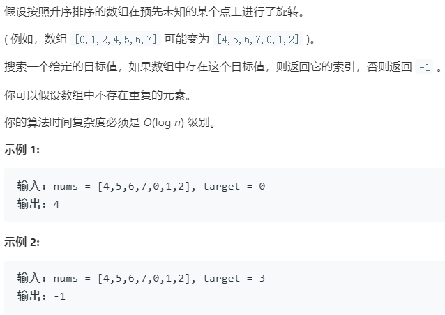

### 题目要求



### 解题思路

核心思想就是找断点！然后看`target`落在哪个增区间就可以解题。但是要注意里面有极端情况重复值！也就是`nums[mid] == nums[low] == nums[height]`，这时就要不断`low++`跳过重复值如果直到`low == mid`都没有发现不重复的那肯定存在于`low = mid + 1`了。

### 本题代码

```c++
class Solution {
public:
    int search(vector<int>& nums, int target) {
        if(nums.size() == 0)
            return -1;
        int low = 0;
        int height = nums.size() - 1;
        while(low <= height){
            int mid = low + (height - low) / 2;
            if(nums[mid] == target)
                return mid;
            if(nums[low] == nums[mid] && nums[low] == nums[height]){
                while(low < mid && nums[low] == nums[mid])
                    low++;
                if(low == mid){
                    low = mid + 1;
                    continue;
                }
            }
            if(nums[low] != nums[mid]){
                if(nums[low] > nums[mid]){
                    if(target >= nums[mid] && target <= nums[height])
                        low = mid + 1;
                    else
                        height = mid - 1;
                }
                else{
                    if(target <= nums[mid] && target >= nums[low])
                        height = mid - 1;
                    else
                        low = mid + 1;
                }
            }
            else{
                if(nums[height] < nums[mid]){
                    if(target <= nums[mid] && target >= nums[low])
                        height = mid - 1;
                    else
                        low = mid + 1;
                }
                else{
                    if(target >= nums[mid] && target <= nums[height])
                        low = mid + 1;
                    else
                        height = mid - 1;
                }
            }
        }
        return -1;
    }
};
```

### [手撸测试](<https://leetcode-cn.com/problems/search-in-rotated-sorted-array/>) 

