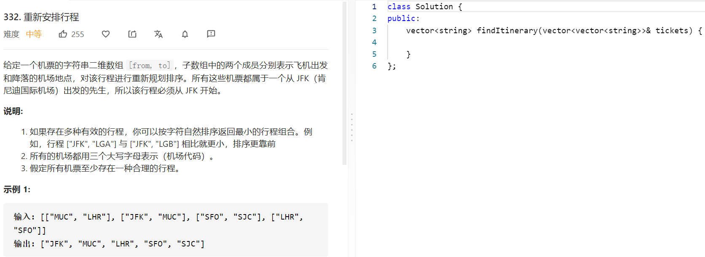
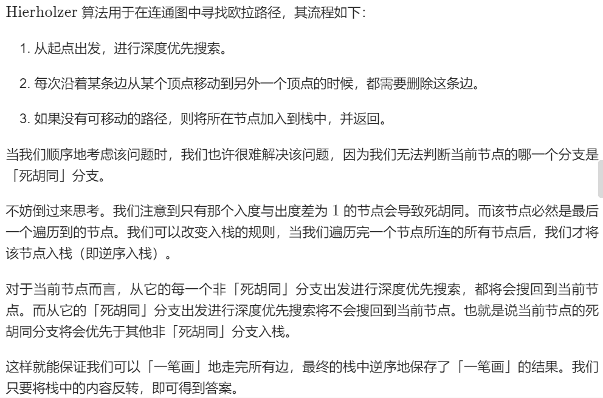

### 题目要求



### 解题思路

求解欧拉回路 / 欧拉通路的题目。给定一个 n*n* 个点 m*m* 条边的图，要求从指定的顶点出发，经过所有的边恰好一次（可以理解为给定起点的「一笔画」问题），使得路径的字典序最小。思路如下：



### 本题代码

```c++
class Solution {
public:
    unordered_map<string, priority_queue<string, vector<string>, greater<string>>>m;
    vector<string>res;
    vector<string> findItinerary(vector<vector<string>>& tickets) {
        for(auto ticket:tickets)
            m[ticket[0]].push(ticket[1]);
        dfs("JFK");
        reverse(res.begin(), res.end());
        return res;
    }
    void dfs(string str){
        while(m.count(str) && m[str].size() > 0){
            string temp = m[str].top();
            m[str].pop();
            dfs(temp);
        }
        res.push_back(str);
    }
};
```

### [手撸测试](https://leetcode-cn.com/problems/reconstruct-itinerary/) 
