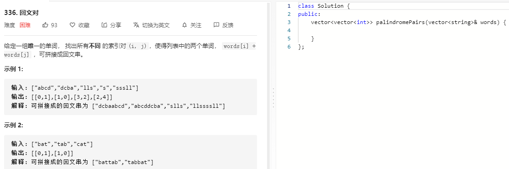

### 题目要求



### 解题思路


该题的常规解法可以使用Trie数+Manacher。

### 本题代码

```c++
class Solution {
public:
    bool isP(string& s, int left, int right){
        while(left < right){
            if(s[left++] != s[right--])
                return false;
        }
        return true;
    }
    vector<vector<int>> palindromePairs(vector<string>& words) {
        vector<vector<int>>res;
        if(words.size() < 2)
            return res;
        unordered_map<string, int>words_index_map;
        set<int>words_len;
        for(int i = 0;i < words.size();i++){
            words_index_map[words[i]] = i;
            words_len.insert(words[i].size());
        }
        for(int i = 0;i < words.size();i++){
            string word_rev = words[i];
            reverse(word_rev.begin(), word_rev.end());
            if(words_index_map.count(word_rev) && words_index_map[word_rev] != i)
                res.push_back({words_index_map[word_rev], i});
            int len = word_rev.size();
            for(auto it = words_len.begin();*it != len;it++){//用的是set因此长度排过序
                int d = *it;
                if(isP(word_rev, 0, len-d-1) && words_index_map.count(word_rev.substr(len-d)))
                    res.push_back({i, words_index_map[word_rev.substr(len-d)]});
                if(isP(word_rev, d, len-1) && words_index_map.count(word_rev.substr(0, d)))
                    res.push_back({words_index_map[word_rev.substr(0,d)], i});
            }
        }
        return res;
    }
};
```

### [手撸测试](https://leetcode-cn.com/problems/palindrome-pairs/)  

