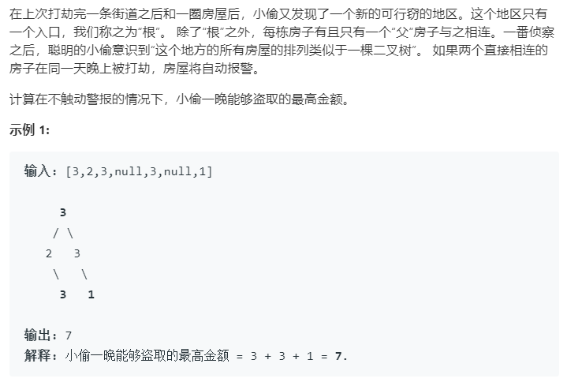

### 题目要求



### 解题思路

输入为树结构数据，比较简单的动归思想是分两种情况--偷根节点或者不投根节点。如果偷根节点那么最大金额可以为$$r+ll+lr+rr+rl$$，其中`ll`指的是该根节点的左树的左树值(其他的类似)；如果不偷根节点，那么最大金额可以为$$l + r$$，其中`l`指的是左树的值。其实在遍历过程中是有重复值的，因此需要一个全局的`hash`表来保存遍历过程中的值的情况。

### 本题代码

```c++
class Solution {
public:
    unordered_map<TreeNode*,int>m;
    int rob(TreeNode* root) {
        int res = 0;
        if(root == NULL)
            return res;
        if(root->right == NULL && root->left == NULL)
            return root->val;
        if(m[root] > 0)
            return m[root]; //如果已经查到 就直接返回
        int l = 0, r = 0, ll = 0, rr = 0, lr = 0, rl = 0;
        if(root->left != NULL){
            l = rob(root->left);
            lr = rob(root->left->right);
            ll = rob(root->left->left);
        }
        if(root->right != NULL){
            r = rob(root->right);
            rl = rob(root->right->left);
            rr = rob(root->right->right);
        }
        res = max(r + l, root->val + ll + lr + rr + rl); //两种情况 要么偷根节点 要么不偷根节点
        m[root] = res;
        return res;
    }
};
```

### [手撸测试](<https://leetcode-cn.com/problems/house-robber-iii/>) 

