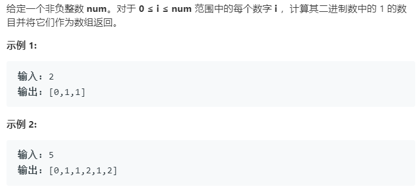

### 题目要求



### 解题思路

按照奇数和偶数的特性遍历即可。当是奇数时，那么在二进制表示中，该奇数一定比其前面那个偶数多一个 1，也就是多的就是最低位的 1；当是偶数时，在二进制表示中，偶数中 1 的个数一定和除以 2 之后的那个数一样多。因为最低位是 0，除以 2 就是右移一位，也就是把那个 0 抹掉而已，所以 1 的个数是不变的。

### 本题代码

```c++
class Solution {
public:
    vector<int> countBits(int num) {
        vector<int>res(num+1, 0);
        for(int i = 1;i <= num;i++){
            if(i & 1 == 1)
                res[i] = res[i - 1] + 1;
            else
                res[i] = res[i / 2];
        }
        return res;
    }
};
```


### [手撸测试](<https://leetcode-cn.com/problems/counting-bits/>) 

