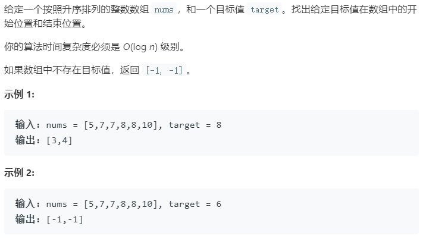

### 题目要求



### 解题思路

两种解题，排完序肯定使用二分法，算法复杂度$$O(logn)$$，也正因为排序可以两边扫描，算法复杂度$$O(n)$$。

二分法思路很简单，但是细节是魔鬼。`while`为什么是`<`因为`right`选择了`nums.size()`，这样搜索区间是`[left, right)`，也就是说每一次`right`是访问不到的--因此就会出现了边界更新为`left = mid + 1`和`right = mid`。第一次找到了`nums[mid]=target`，为了继续找最左边的边界，巧妙在于使用`right = mid`，这样就可以压缩区间去找左边的边界；相反为了找到最右边的边界，当第一次找到了`nums[mid]=target`后，使用`left = mid + 1`。

### 本题代码

#### 二分法

```c++
class Solution {
public:
    vector<int> searchRange(vector<int>& nums, int target) {
        if(nums.size() == 0)
            return {-1, -1};
        int left = 0, right = nums.size();
        while(left < right){
            int mid = left + (right - left) / 2;
            if(target == nums[mid])
                right = mid;
            else if(target < nums[mid])
                right = mid;
            else if(target > nums[mid])
                left = mid + 1;
        }
        vector<int>res;
        if(left == nums.size())
            return {-1, -1};
        else if(nums[left] == target)
            res.push_back(left);
        else
            return {-1, -1};

        left = 0, right = nums.size();
        while(left < right){
            int mid = left + (right - left) / 2;
            if(nums[mid] == target)
                left = mid + 1;
            else if(target < nums[mid])
                right = mid;
            else if(target > nums[mid])
                left = mid + 1;
        } 
        res.push_back(left - 1);
        return res;
    }
};
```

#### 前后扫描

```c++
class Solution {
public:
    vector<int> searchRange(vector<int>& nums, int target) {
        vector<int>res = {-1, -1};
        for(int i = 0;i < nums.size();i++){
            if(target == nums[i]){
                res[0] = i;
                break;
            }
        }
        if(res[0] == -1)
            return res;
        for(int i = nums.size() - 1;i >= 0;i--){
            if(target == nums[i]){
                res[1] = i;
                break;
            }
        }
        return res;
    }
};
```

### [手撸测试](<https://leetcode-cn.com/problems/find-first-and-last-position-of-element-in-sorted-array/>) 
