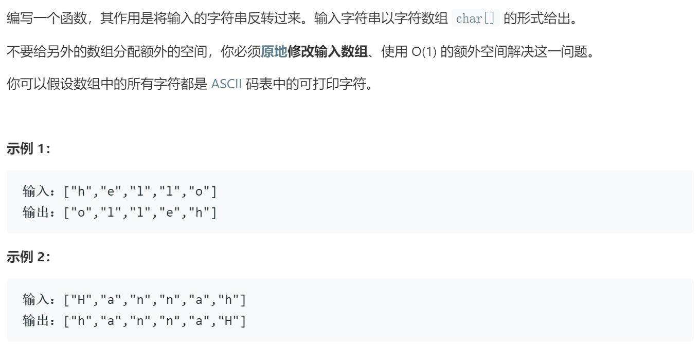

### 题目要求



### 解题思路

直接法。

### 本题代码

```c++
class Solution {
public:
    void reverseString(vector<char>& s) {
        if(s.size() == 0)
            return;
        int l = 0, r = s.size() - 1;
        while(l < r){
            int temp = s[l];
            s[l] = s[r];
            s[r] = temp;
            l++;
            r--;
        }
    }
};
```

### [手撸测试](https://leetcode-cn.com/problems/reverse-string/)  

