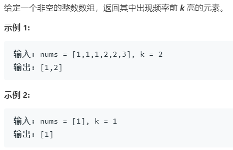

### 题目要求



### 解题思路

利用哈希表统计，然后对频率排序，最后保存到`res`中

### 本题代码

```c++
class Solution {
public:
    vector<int> topKFrequent(vector<int>& nums, int k) {
        unordered_map<int, int>m;
        for(auto num : nums)
            m[num]++;
        vector<pair<int,int>>vec(m.begin(), m.end());
        sort(vec.begin(), vec.end(), [](pair<int, int>& a, pair<int, int>& b){return a.second > b.second;});
        auto a = vec.begin();
        vector<int>res;
        while(k-- != 0){
            res.push_back(a->first);
            a++;
        }
        return res;
    }
};
```

### [手撸测试](<https://leetcode-cn.com/problems/top-k-frequent-elements/>) 

