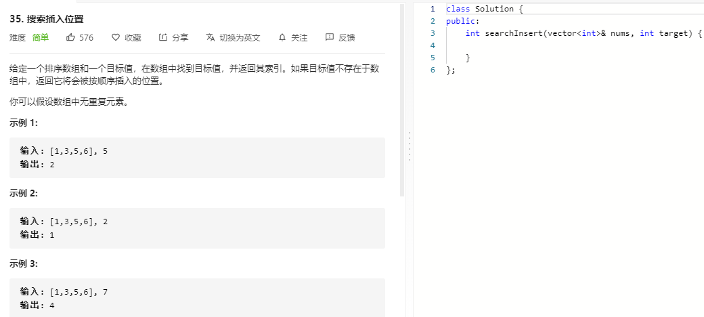

### 题目要求



### 解题思路

简单的手撸二分法，但是细节是魔鬼。

### 本题代码

```c++
class Solution {
public:
    int searchInsert(vector<int>& nums, int target) {
        int left = 0, right = nums.size(); // 选择了左闭右开区间
        while(left < right){
            int mid = left + (right - left) / 2; // 防止溢出
            if(nums[mid] == target)
                return mid;
            else if(nums[mid] > target) // mid选不到
                right = mid;
            else
                left = mid+1; // 跳过mid
        }
        return left;
    }
};
```

### [手撸测试](https://leetcode-cn.com/problems/search-insert-position/)  

