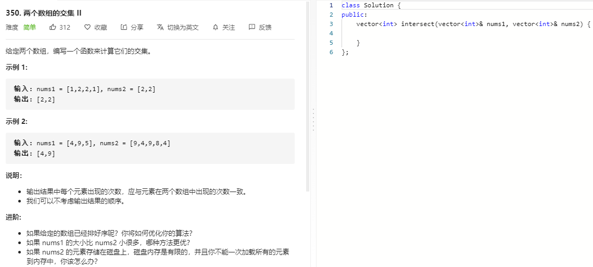

### 题目要求



### 解题思路

两种解法，第一种是用`hash`表：记录短数组的数字出现个数，然后遍历长数组有则放入`res`中，个数减一(为0就erase)。第二种使用排序数组，指针移动谁小移动谁，相同同时移动。

### 本题代码

#### 解法1

```c++
class Solution {
public:
    vector<int> intersect(vector<int>& nums1, vector<int>& nums2) {
        if(nums1.size() > nums2.size())
            return intersect(nums2, nums1);
        vector<int>res;
        unordered_map<int, int>m;
        for(int num: nums1)
            ++m[num];
        for(int num: nums2){
            if(m.count(num)){
                res.push_back(num);
                --m[num];
                if(m[num] == 0)
                    m.erase(num);
            }
        }
        return res;
    }
};
```

#### 解法2

```c++
class Solution {
public:
    vector<int> intersect(vector<int>& nums1, vector<int>& nums2) {
        if(nums1.empty() || nums2.empty())
            return vector<int>();
        sort(nums1.begin(),nums1.end());
        sort(nums2.begin(),nums2.end());
        vector<int>res;
        for(int i = 0,j = 0;i < nums1.size() && j < nums2.size();){
            if(nums1[i] > nums2[j])
                j++;
            else if(nums1[i] < nums2[j])
                i++;
            else{
                res.push_back(nums1[i]);
                i++;
                j++;
            }
        }
        return res;
    }
};
```

### [手撸测试](https://leetcode-cn.com/problems/intersection-of-two-arrays-ii/)  

