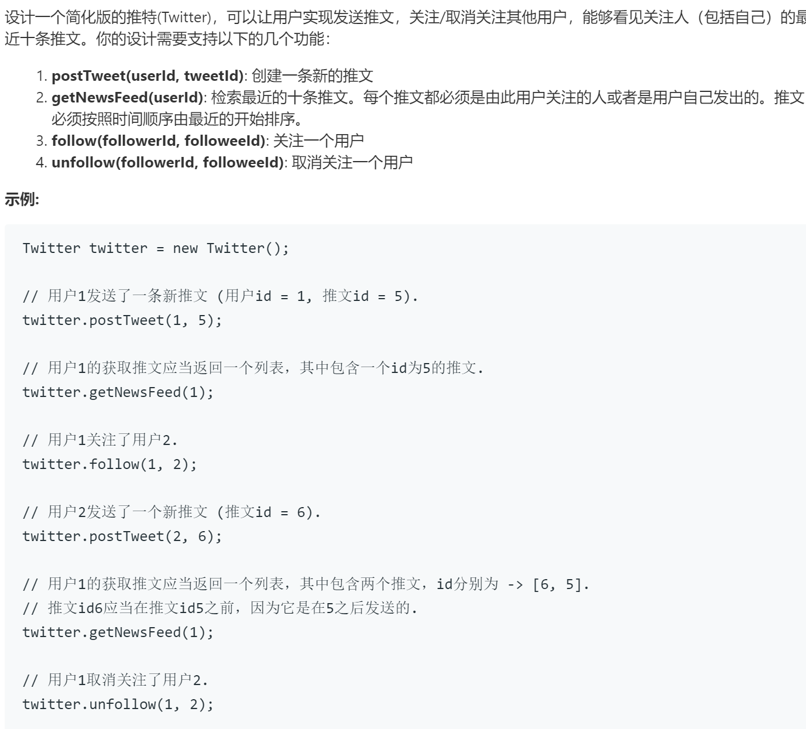

### 题目要求



### 解题思路

思路很简单。首先使用双端队列将每个用户的`<time, tweetId>`保存，当队列大于`10`就把老时间的弹出来；其次使用二维矩阵来保存用户之间的关注情况(用户永远关注自己)；最后取用户的`id`和其关注的用户所有的`tweet`拿出来放进大根堆里(`time`最新鲜)，最后输出。

### 本题代码

```c++
class Twitter {
public:
    bool a[510][510];//个用户间的关注关系
    deque<pair<int, int>>b[510];//每个用户的推特情况
    long long time = 0;
    Twitter() {
        memset(a, 0, sizeof(a));
        for(int i = 0;i < 510;i++) a[i][i] = true;
        for(int i = 0;i < 510;i++) b[i].clear();
        time = 0;
    }
    
    void postTweet(int userId, int tweetId) {
        time++;
        if(b[userId].size() >= 10)
            b[userId].pop_front();
        b[userId].push_back(make_pair(time, tweetId));
    }
    
    vector<int> getNewsFeed(int userId) {
        priority_queue<pair<int,int>> q;
        for(int i = 0;i < 510;i++){
            if(a[userId][i]){
                for(auto vec: b[i])
                    q.push(vec);
            }
        }
        vector<int>res;
        for(int i = 0;i < 10 && !q.empty();i++){
            res.push_back(q.top().second);
            q.pop();
        }
        return res;
    }
    
    void follow(int followerId, int followeeId) {
        a[followerId][followeeId] = true;
    }
    
    void unfollow(int followerId, int followeeId) {
        if(followerId != followeeId)
            a[followerId][followeeId] = false;
    }
};
```

### [手撸测试](https://leetcode-cn.com/problems/design-twitter/)  

