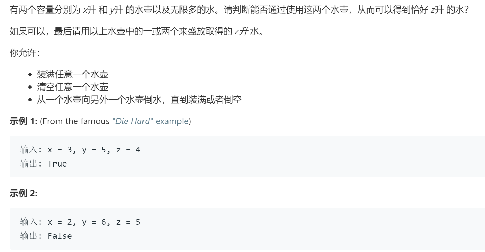

### 题目要求



### 解题思路

首先，从两个水壶里的整体水量来看，每次操作，可分为下列情况：
1.往空壶里加满水，总量加x/y；
2.倒掉一壶水（满），总量减x/y；
3.倒掉一壶水（不满），总量变成x/y/0；
4.往不满的壶里加水，总量变为x/y/x+y；
5.从一个壶往另一个壶里倒水，总量不变；

所以，两个壶里水的总量一定是`ax+by`（a,b为整数），立即推，当`z=ax+by`时，返回`true`。

然后是贝祖定理：若`x,y`是整数,且`gcd(x,y)=d`，那么对于任意的整数`a,b,ax+by`都一定是d的倍数，特别地，一定存在整数`a,b`，使`ax+by=d`成立。

由贝祖定理可知，若存在整数a,b，使得`ax+by=z`成立，则`z`一定为`x,y`最大公因数的整数倍。

证明如下：

> 设x,y的最大公因数为d；
> 故存在整数i,j,使得x=i*d,y=j*d；
> 若ax+by=z成立，则
> ax+by = a*(i*d)+b*(j*d) = (a*i+b*j)*d = z；
> 由此可得，z为d的整数倍。

所以，这道题就变成了判断z是否是x,y最大公因数的整数倍

### 本题代码

```c++
class Solution {
public:
    bool canMeasureWater(int x, int y, int z) {
        if(z < 0 || z > x + y)
            return false;
        if(z == 0)
            return true;
        int g;
        if(x == 0 || y == 0){
            g = x + y;
        }
        else{
            g = gcd(x,y);
        }
        return !(z%g);
    }
    int gcd(int a, int b){
        if(a < b)
            swap(a,b);
        return b == 0 ? a : gcd(b, a%b);
    }
    void swap(int& a, int& b){
        int c = a;
        a = b;
        b = c;
    }
};
```

### [手撸测试](https://leetcode-cn.com/problems/water-and-jug-problem/)  

