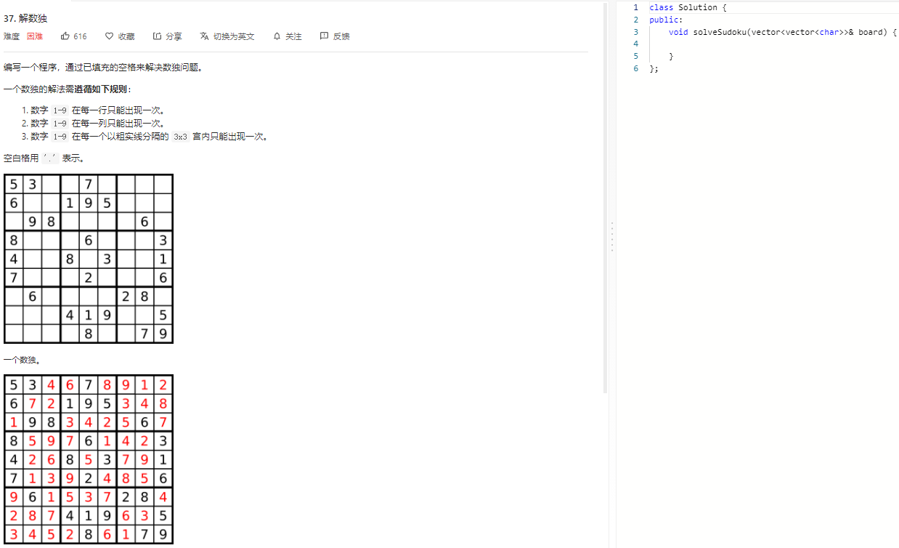

### 题目要求



### 解题思路

回溯递归算法。每一行中每一个数字以及每一列每一个数字以及每一个block每一个数字的遍历情况，其中行最大为9，列最大为9，而每个block中就是i/3以及j/3。可以填写的数字范围为 \[1, 9]，而数组的下标从 0 开始，因此在存储时，我们使用一个长度为 9 的布尔类型的数组，其中 i 个元素的值为 $$\text{True}$$，当且仅当数字 i+1 出现过。例如我们用 $$\textit{line}[2][3] = \text{True}$$ 表示数字 4 在第 2 行已经出现过，那么当我们在遍历到第 2 行的空白格时，就不能填入数字 4。

### 本题代码

```c++
class Solution {
public:
    bool rows[9][9];
    bool cols[9][9];
    bool block[3][3][9];
    bool vail;
    vector<pair<int, int>>space;
    void dfs(vector<vector<char>>& board, int pos){
        if(pos == space.size()){
            vail = true; //遍历完成返回
            return;
        }
        auto [i,j] = space[pos];
        for(int digit = 0;digit < 9 && !vail;digit++){
            if(!rows[i][digit] && !cols[j][digit] && !block[i/3][j/3][digit]){
                rows[i][digit] = cols[j][digit] = block[i/3][j/3][digit] = true;
                board[i][j] = digit + '0' + 1;
                dfs(board, pos+1); //回溯
                rows[i][digit] = cols[j][digit] = block[i/3][j/3][digit] = false;
            }
        }
    }
    void solveSudoku(vector<vector<char>>& board) {
        if(board.size() == 0)
            return;
        memset(rows, false, sizeof(rows));
        memset(cols, false, sizeof(cols));
        memset(block, false, sizeof(block));
        vail = false; //遍历结束标注
        for(int i = 0;i < 9;i++){
            for(int j = 0;j < 9;j++){
                if(board[i][j] == '.')
                    space.push_back({i,j}); //将每一个需要填充的值放入其中
                else{
                    int digit = board[i][j] - '0' - 1; // 1-9 因此需要-1
                    rows[i][digit] = cols[j][digit] = block[i/3][j/3][digit] = true;//表示位置该数字已经存在
                }
            }
        }
        dfs(board, 0);
    }
};
```

### [手撸测试](https://leetcode-cn.com/problems/sudoku-solver/)  

