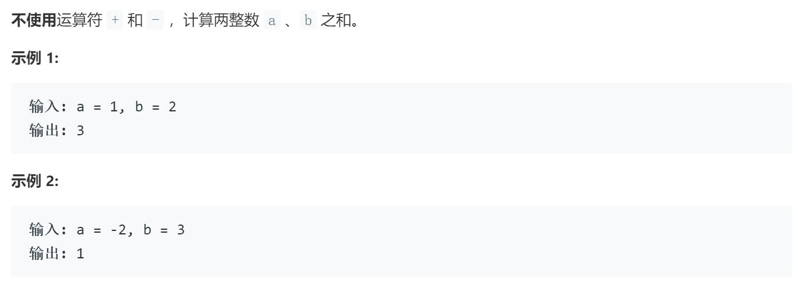

### 题目要求



### 解题思路

不用加减乘除法来完成加减乘除可以[参考](https://blog.csdn.net/qq_34342154/article/details/77865338)，对于本题主要是注意异或是加，考虑进位就是相与移位。

### 本题代码

```c++
class Solution {
public:
    int getSum(int a, int b) {
        int sum = a;
        while(b){
            sum = a ^ b;
            b = (unsigned int)(a & b )<<1;
            a = sum;
        }
        return sum;
    }
};
```

### [手撸测试](https://leetcode-cn.com/problems/sum-of-two-integers/)  

