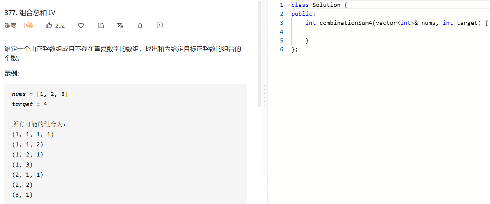
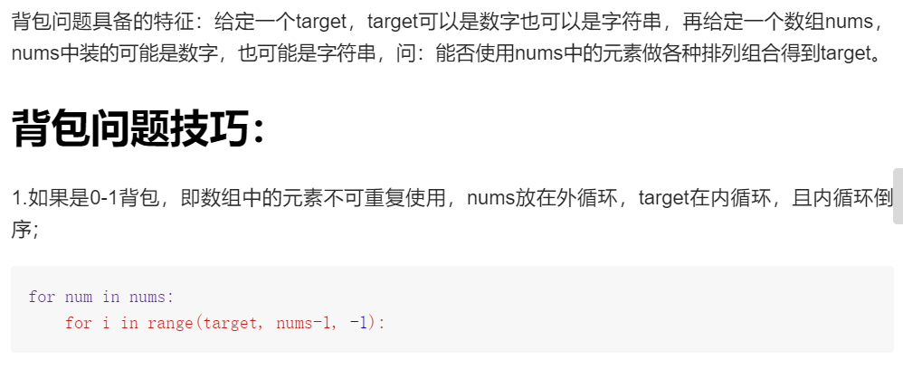
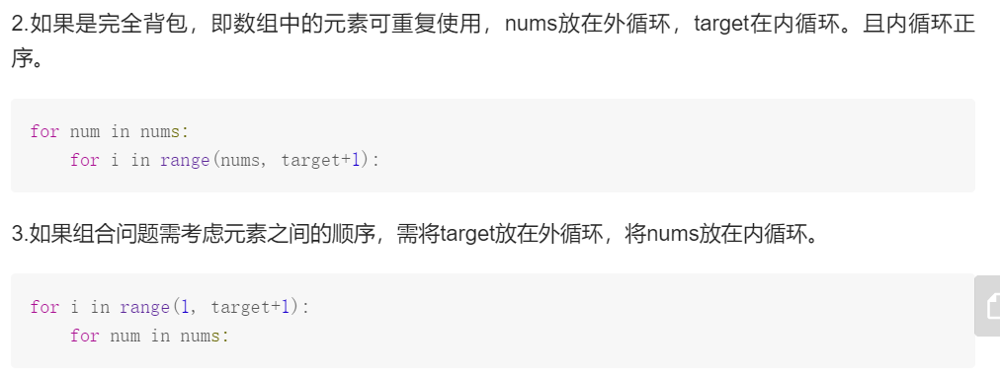

### 题目要求



### 解题思路





### 本题代码

```c++
class Solution {
public:
    int combinationSum4(vector<int>& nums, int target) {
        if(nums.size() == 0)
            return 0;
        vector<unsigned long long>dp(target+1, 0);
        dp[0] = 1;
        for(int i = 1;i <= target;i++){
            for(auto num: nums)
                if(i >= num){
                    dp[i] += dp[i-num];
                }
        }
        return dp[target];
    }
};
```

### [手撸测试](https://leetcode-cn.com/problems/combination-sum-iv/)  

