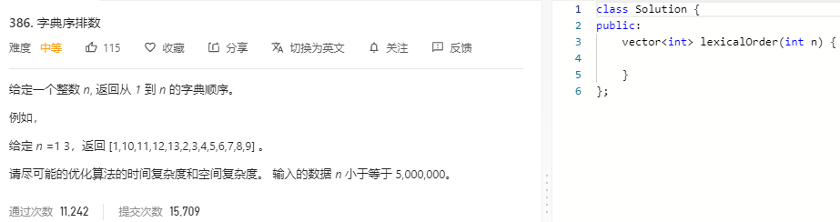

### 题目要求



### 解题思路

dfs的直接手撸。模拟十叉树的生成过程就可。

### 本题代码

```c++
class Solution {
public:
    vector<int> lexicalOrder(int n) {
        vector<int>res;
        for(int i = 1;i < 10;i++){
            dfs(n, i, res);
        }
        return res;
    }
    void dfs(int n, int cur, vector<int>& res){
        if(cur > n)
            return;
        res.push_back(cur);
        for(int i = 0;i < 10;i++){
            dfs(n, cur*10+i, res);
        }
    }
};
```

### [手撸测试](https://leetcode-cn.com/problems/lexicographical-numbers/)  

