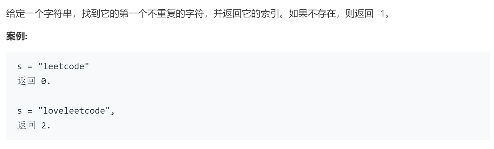

### 题目要求



### 解题思路

一遍`hash`解决问题。

### 本题代码

```c++
class Solution {
public:
    int firstUniqChar(string s) {
        map<int,int>m;
        for(auto c:s)
            m[c]++;
        for(int i = 0;i < s.size();i++){
            if(m[s[i]] == 1)
                return i;
        }
        return -1;
    }
};
```

### [手撸测试](https://leetcode-cn.com/problems/first-unique-character-in-a-string/)  

