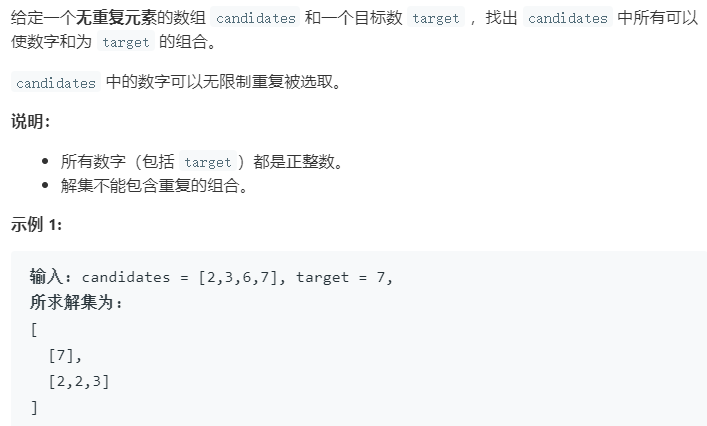

### 题目要求



### 解题思路

直接就是DFS回溯就完事了，当然考虑剪枝的问题。

### 本题代码

```c++
class Solution {
public:
    vector<vector<int>> combinationSum(vector<int>& candidates, int target) {
        vector<vector<int>>res;
        sort(candidates.begin(), candidates.end());
        vector<int>path;
        dfs(res, path, target, candidates, 0);
        return res;
    }
    void dfs(vector<vector<int>>& res, vector<int>& path, int target, vector<int>& candidates, int begin){
        if(target == 0){
            res.push_back(path);
        }
        else{
            for(int i = begin;i < candidates.size() && target - candidates[i] >= 0;i++){
                path.push_back(candidates[i]);
                dfs(res, path, target - candidates[i], candidates, i);
                path.pop_back();
            }
        }
    }
};
```

### [手撸测试](<https://leetcode-cn.com/problems/combination-sum/>) 
