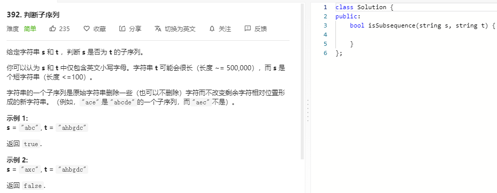

### 题目要求



### 解题思路

贪心双指针。i为s的指针，j为t的指针，若 $$i_i$$ 和 $$i_2$$ 都匹配了t[j]，那么使用 $$i_1$$ ，因为 $$i_2$$ 后面能匹配的都会被 $$i_{1}$$ 匹配。 

### 本题代码

```c++
class Solution {
public:
    bool isSubsequence(string s, string t) {
        if(s.size() > t.size())
            return false;
        int i = 0, j = 0;
        while(i < s.size() && j < t.size()){
            if(s[i] == t[j]){
                i++;
            }
            j++;
        }
        return i == s.size();
    }
};
```

### [手撸测试](https://leetcode-cn.com/problems/is-subsequence/)  

