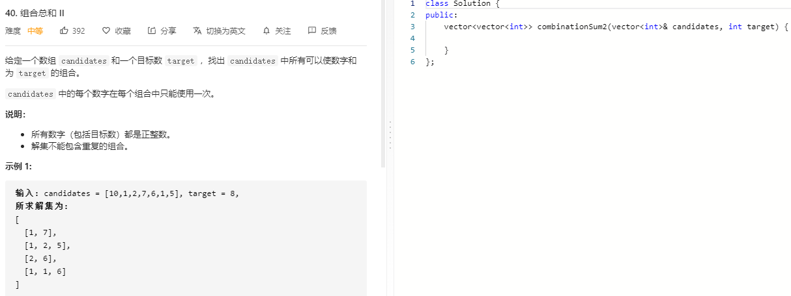

### 题目要求



### 解题思路

最简单的选或者不选，选择之后再判断加和是否满足条件。

### 本题代码

```c++
class Solution {
public:
    vector<vector<int>>res;
    vector<vector<int>> combinationSum2(vector<int>& candidates, int target) {
        vector<int>path;
        sort(candidates.begin(), candidates.end());
        set<vector<int>>s;
        dfs(s, candidates, path, 0, 0, target);
        return res;
    }
    void dfs(set<vector<int>>& s, vector<int>& candidates, vector<int>& path, int sum, int i, int target){
        if(sum > target || i >= candidates.size()){ //先判断是否加和超过target可以提前终止
            return;
        }
        
        sum += candidates[i];
        path.push_back(candidates[i]);
        if(sum == target){
            if(s.find(path) == s.end()){
                res.push_back(path);
                s.insert(path);
            }
        }
        dfs(s, candidates, path, sum, i+1, target);
        path.pop_back();
        sum -= candidates[i];

        dfs(s, candidates, path, sum, i+1, target);
        
    }
};
```

### [手撸测试](https://leetcode-cn.com/problems/combination-sum-ii/)  

