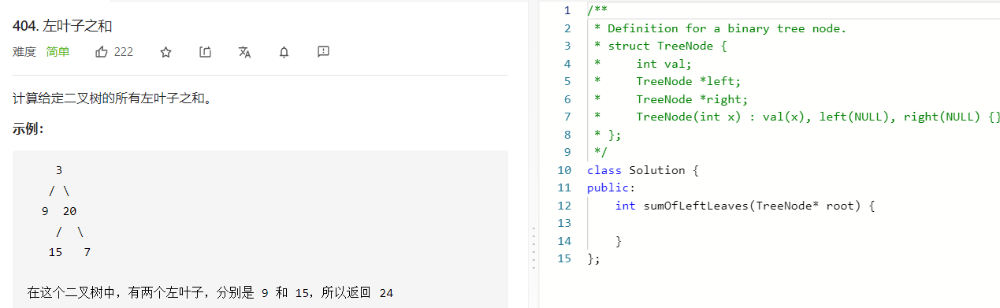

### 题目要求



### 解题思路

直接手撸，注意是左**叶**子节点。

### 本题代码

```c++
class Solution {
public:
    int sumOfLeftLeaves(TreeNode* root) {
        int res = 0;
        if(root == NULL)
            return res;
        queue<TreeNode*>q;
        q.push(root);
        while(!q.empty()){
            TreeNode* node = q.front();
            if(node->left){
                if(!node->left->left && !node->left->right)
                    res += node->left->val;
                q.push(node->left);
            }
            if(node->right)
                q.push(node->right);
            q.pop();
        }
        return res;
    }
};
```

### [手撸测试](https://leetcode-cn.com/problems/sum-of-left-leaves/)  

