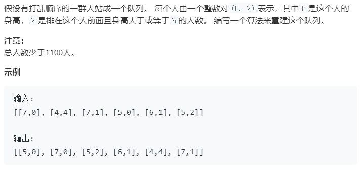

### 题目要求



### 解题思路

思路就是先排序然后插入。

### 本题代码

```c++
class Solution {
public:
    vector<vector<int>> reconstructQueue(vector<vector<int>>& people) {
        if(people.size() == 0)
            return vector<vector<int>>();
        vector<vector<int>>res;
        sort(people.begin(), people.end(), compare);//在此排序 按身高从大到小的顺序
        for(auto e : people){
            res.insert(res.begin() + e[1], e);//然后插入位置
        }
        return res;
    }
    static bool compare(const vector<int>& a, const vector<int>& b){
        if(a[0] > b[0])
            return true;
        if(a[0] == b[0] && a[1] < b[1])
            return true;
        return false;
    }
};
```

### [手撸测试](<https://leetcode-cn.com/problems/queue-reconstruction-by-height/>) 

