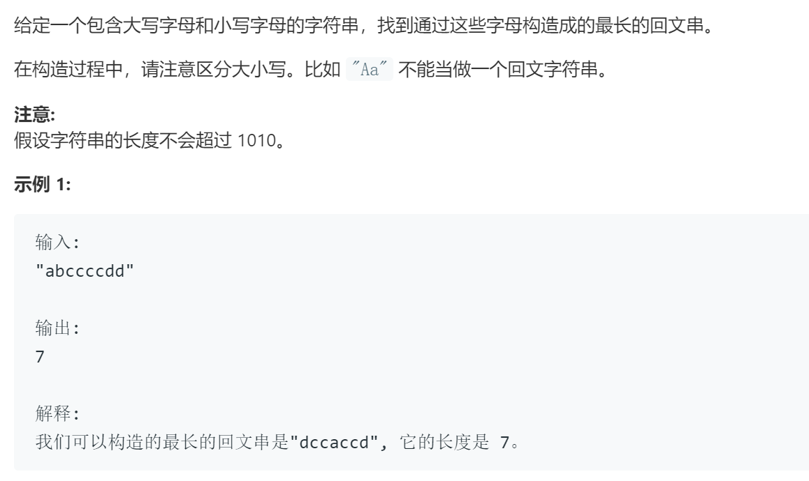

### 题目要求



### 解题思路

根据回文子串的特性，最后会转化为求解奇数的个数。

### 本题代码

```c++
class Solution {
public:
    int longestPalindrome(string s) {
        int m[52] = {0};
        for(char c : s){
            if(c >= 'a' && c <= 'z')
                m[c - 'a']++;
            else
                m[c - 'A' + 26]++;
        }
        int res = 0;
        for(int i = 0;i < 52;i++){
            if((res & 1) && (m[i] & 1))
                res += m[i] - 1;
            else
                res += m[i];
        }
        return res;
    }
};
```

### [手撸测试](https://leetcode-cn.com/problems/longest-palindrome/solution/tu-jie-hui-wen-chuan-by-time-limit/)  

