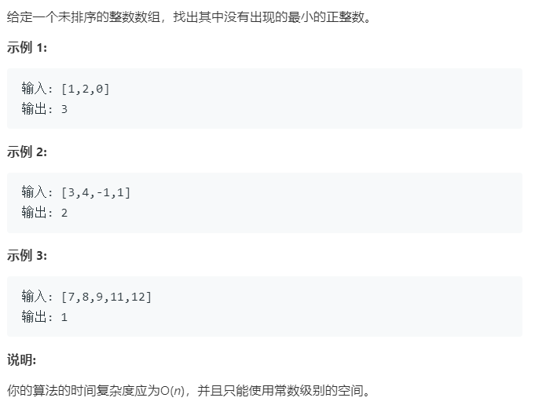

### 题目要求



### 解题思路

看见题，第一方法排序然后寻找最小未出现的正整数，但是算法复杂度不满足要求。本题解法是使用桶排序思想--抽屉原理。例如数组`nums = [3,-1,4,2]`，核心在于正确放置的数字`nums[i]`和索引`i`的关系是`i = nums[i] - 1`，也就是将`nums[i]`元素放置在索引为`i+1`处，即`nums[0] = 3`放在索引为`2`处--也就是`nums[i] - 1 = i`。当`nums[i]`的数字大于`nums`数组的长度或者小于`0`就跳过或者已经满足正确放置就继续遍历。

### 本题代码

```c++
class Solution {
public:
    int firstMissingPositive(vector<int>& nums) {
        for(int i = 0;i < nums.size();i++){
            while(nums[i] != i + 1){//数字nums[i]应该放在i + 1
                if(nums[i] <= 0 || nums[i] > nums.size() || nums[i] == nums[nums[i] - 1])//最后一个条件是防止出现重复值数组[1,1]来回换，其他如[3,3]就不会来回换
                    break;
                int index = nums[i] - 1;
                nums[i] = nums[index];
                nums[index] = index + 1;
            }
        }
        for(int i = 0;i < nums.size();i++){
            if(nums[i] != i + 1){
                return i + 1;
            }
        }
        return nums.size() + 1;
    }
};
```

### [手撸测试](<https://leetcode-cn.com/problems/first-missing-positive/>) 

