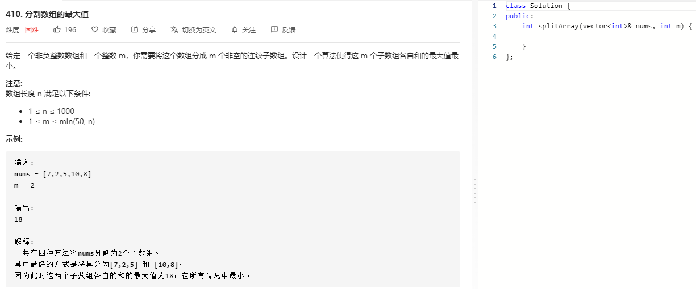

### 题目要求



### 解题思路

两种解法：(1)动态规划；(2)二分查找+贪心；

#### 解法一 动态规划

状态：使用`dp[i][j]`表示`nums`前`i`个数分成`j`个连续子数组，并且各个子数组之和最大值最小的结果。

转移方程：那么当选前`k`个数时，状态转移方程为：$$dp[i][j] = min(dp[i][j], max(dp[k][j-1], subsum(k+1, i)))$$,其中`subsum(k+1, i)`表示后面`i-k`个数连续总和。

初始条件：限定`i>=j`,并且在`i<j`时填充`INT_MAX`这样在`min`的时候能确保取到正确值。

#### 解法二 二分查找+贪心

二分查找的属性点--在最大中找最小值，而且最大值有范围：[max(nums[i]), sum(nums)]，当1<=m<=nums.size()。根据题目的要求--m个最大的非负连续数组中的最小值，可以判断split_m = f(split_nums_min), 表示满足split_nums_min的分割数，也即使用`nums`数组构成的所有连续子数组不能大于split_nums_min，否则就重新划分新的数组。那么每次split_nums_min取[max(nums[i]), sum(nums)]中位数得到split_m 和 m 判断，如果 split_m > m 那么表示分多了 split_nums_min 比较小(因为 split_nums_min 随着 split_m 增大而变小)，则 left = split_nums_min  + 1, 相反 right = split_nums_min来逼近。

本题属于最大化最小值，通常是一类竞赛题，有固定的思路，是固定套路题，**需要背！！！**相似的题有：

leetcode 875, 1482, 1011以及LCP 12  ~~后续更新这些题目。~~

### 本题代码

#### 解法一 动态规划

```c++
class Solution {
public:
    int splitArray(vector<int>& nums, int m) {
        if(nums.size() <= 0 || nums.size() < m || m <= 0)
            return 0;
        int n = nums.size();
        vector<vector<long>>dp(n+1, vector<long>(m+1, INT_MAX));
        vector<long>s(n+1, 0);
        for(int i = 0;i < n;i++){
            s[i+1] = s[i] + nums[i];
        }
        dp[0][0] = 0;
        for(int i = 1;i <= n;i++){
            for(int j = 1;j <= min(i, m);j++){ // min确保取值有效
                for(int k = 0;k < i;k++){//前面k个数的j-1分割，后面i-k个数之和，
                    dp[i][j] = min(dp[i][j], max(dp[k][j-1], s[i]-s[k]));
                }
            }
        }
        return dp[n][m];
    }
};
```

#### 解法二 二分查找

```c++
class Solution {
public:
    int splitArray(vector<int>& nums, int m) {
        if(nums.size() <= 0 || nums.size() < m || m <= 0)
            return 0;
        long left = 0, right = 0;
        for(auto num: nums){
            right += num;
            left = left > num ? left : num;
        }
        while(left < right){
            long mid = left + (right-left) / 2;
            int cnt = split(nums, mid);
            if(cnt > m)
                left = mid + 1;
            else
                right = mid;
        }
        return left;
    }
    int split(vector<int>& nums, int nums_min){
        long cur_nums_sum = 0;
        int cnt = 1;
        for(auto num: nums){
            if(cur_nums_sum + num > nums_min){ // 尝试加上当前num是否大于最小值判断是否需要重新建立新的子数组
                cnt++;
                cur_nums_sum = 0;
            }
            cur_nums_sum += num;
        } 
        return cnt;
    }
};
```


### [手撸测试](https://leetcode-cn.com/problems/split-array-largest-sum/) 

