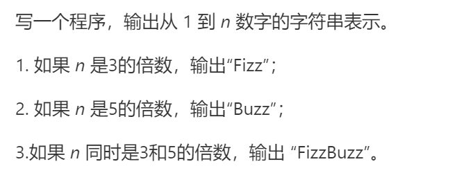

### 题目要求



### 解题思路

直接法。

### 本题代码

```c++
class Solution {
public:
    vector<string> fizzBuzz(int n) {
        vector<string>res;
        for(int i = 1;i <= n;i++){
            bool isDiv3 = (i % 3) == 0;
            bool isDiv5 = (i % 5) == 0;
            if(isDiv3 && isDiv5)
                res.push_back("FizzBuzz");
            else if(isDiv3){
                res.push_back("Fizz");
            }
            else if(isDiv5){
                res.push_back("Buzz");
            }
            else{
                res.push_back(to_string(i));
            }
        }
        return res;
    }
};
```

### [手撸测试](https://leetcode-cn.com/problems/fizz-buzz/)  

