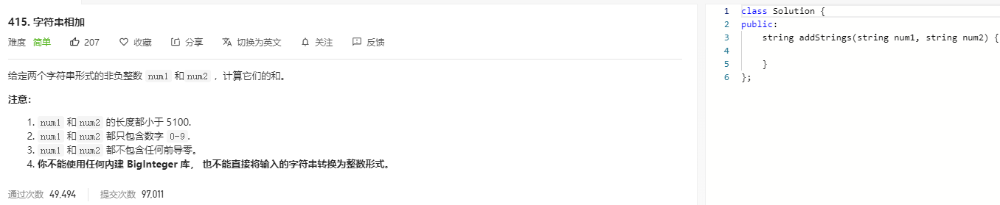

### 题目要求



### 解题思路

其实可以倒着索引，和 [2 两数相加](2.md) 很像。

### 本题代码

```c++
class Solution {
public:
    string addStrings(string num1, string num2) {
        if(num1.size() == 0 || num2.size() == 0)
            return num1.size() != 0 ? num1 : num2;
        string res = "";
        stack<char>s1;
        stack<char>s2;
        for(char c: num1)
            s1.push(c);
        for(char c: num2)
            s2.push(c);
        int c = 0;
        while(!s1.empty() || !s2.empty()){
            int x = !s1.empty() ? s1.top() - '0' : 0;
            int y = !s2.empty() ? s2.top() - '0' : 0;
            
            res.insert(res.begin(), (x+y+c)%10+'0');
            c = (x+y+c) / 10;
            if(!s1.empty())
                s1.pop();
            if(!s2.empty())
                s2.pop();
        } 
        if(c == 1)
            res.insert(res.begin(), '1');
        return res;

    }
};
```

### [手撸测试](https://leetcode-cn.com/problems/add-strings/)  

