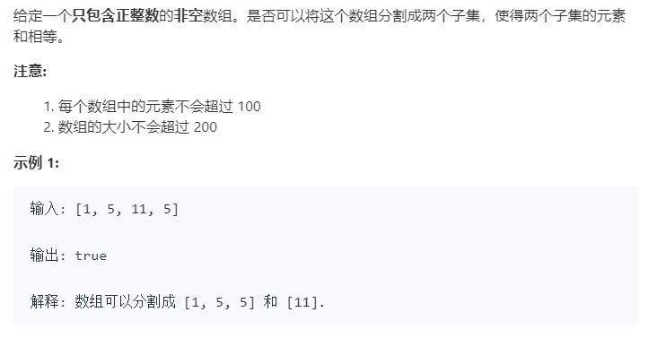

### 题目要求



### 解题思路

使用动态规划解题，属于0-1背包问题。构建动态规划表$$dp[i][j]$$表示的是`[0,i]`的元素是否能组成和为`j`。那么$$dp[i][j]$$的状态要么选择`nums[i]`要么不选择`nums[i]`，动态转移方程是$$dp[i][j] = dp[i - 1][j] || dp[i - 1][j - nums[i]]$$，或运算前表示的是不选择`nums[i]`，或运算之后表示的是选择`nums[i]`。另外本题的题意可以转述为：

> 给定一个只包含正整数的非空数组。是否可以从这个数组中挑选出一些正整数，每个数只能用一次，使得这些数的和等于整个数组元素的和的一半。

### 本题代码

```c++
class Solution {
public:
    bool canPartition(vector<int>& nums) {
        if(nums.size() == 0)
            return false;
        int size = nums.size();
        int sum = 0;
        for(int num : nums)
            sum += num;
        if(sum & 1)
            return false;
        int target = sum / 2;
        vector<vector<bool>>dp(size, vector<bool>(target + 1, false));
        for(int i = 1;i <= target;i++){
            if(nums[0] == i){
                dp[0][i] = true;
                break;
            }
        }
        for(int i = 1;i < size;i++){
            for(int j = 0;j <= target;j++){
                dp[i][j] = dp[i - 1][j];
                if(j >= nums[i])
                    dp[i][j] = dp[i - 1][j] || dp[i - 1][j - nums[i]];
            }
        }
        return dp[size - 1][target];
    }
};
```

### [手撸测试](<https://leetcode-cn.com/problems/partition-equal-subset-sum/>) 

