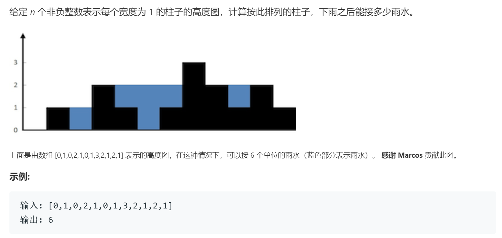

### 题目要求



### 解题思路

对于输入的柱子数列`height`，每一根上的蓄水量是由左右两边最大的`height`中最小的减去该柱子的高度得到的，那么计算出每一个柱子所在位置左右最高的最小值即可。

### 本题代码

```c++
class Solution {
public:
    int trap(vector<int>& height) {
        if(height.size() == 0)
            return 0;
        int n = height.size();
        int* l_max = new int[n];
        int* r_max = new int[n];
        l_max[0] = height[0];
        r_max[n - 1] = height[n - 1];
        for(int i = 1;i < n;i++){
            l_max[i] = max(l_max[i - 1], height[i]);
        }
        for(int i = n - 2;i >= 0;i--){
            r_max[i] = max(r_max[i + 1], height[i]);
        }
        int res = 0;
        for(int i = 0;i < n;i++){
            res += min(l_max[i], r_max[i]) - height[i];
        }
        return res;
    }
};
```

### [手撸测试](https://leetcode-cn.com/problems/trapping-rain-water/)  

