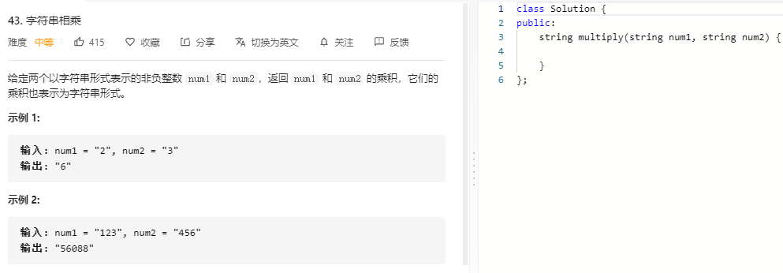

### 题目要求



### 解题思路

直接使用相乘的方法。其中两个数相乘之后总位数一共是`m+n`个，最高位可能没有。那就从最低位(对应string的最右位置)算起，涉及到错位相加，整体就是为了填满`m+n`位。

### 本题代码

```c++
class Solution {
public:
    string multiply(string num1, string num2) {
        if(num1.size() == 0 || num2.size() == 0 || num1 == "0" || num2 == "0")
            return "0";
        int m = num1.size(), n = num2.size();
        vector<int>temp(m+n, 0);
        for(int i = m-1;i >= 0;i--){
            int x = num1[i]-'0';
            for(int j = n-1;j >= 0;j--){
                int y = num2[j]-'0';
                temp[i+j+1] += x*y;
            }
        }
        string res = "";
        for(int i = m+n-1;i > 0;i--){
            temp[i-1] += temp[i] / 10;
            temp[i] %= 10; 
        }
        int index = temp[0] == 0 ? 1 : 0;
        for(int i = index;i < temp.size();i++)
            res.push_back(temp[i]+'0');
        return res;
    }
};
```

### [手撸测试](https://leetcode-cn.com/problems/multiply-strings/)  

