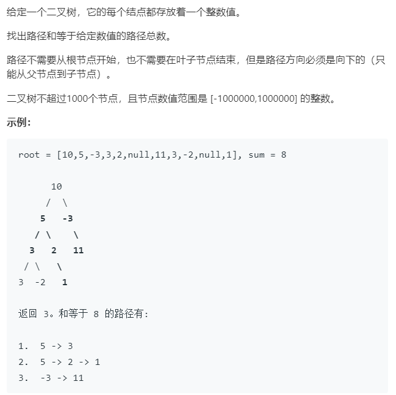

### 题目要求



### 解题思路

注意题目要求，从根节点或者左数中某一结点或者右数中某一结点找到路径和为目标值的路径个数，它甚至不要求走到叶节点，但是注意一定是要从上到下的。这种题直接就是递归一把梭，原理很简单看代码就可以。

### 本题代码

```c++
class Solution {
public:
    int pathSum(TreeNode* root, int sum) {
        if(root == NULL)
            return 0;
        return helper(root, sum) + pathSum(root->left, sum) + pathSum(root->right, sum);
    }
    int helper(TreeNode* root, int sum){
        if(root == NULL)
            return 0;
        sum -= root->val;// 因为不一定走到叶节点
        // 这个括号一定要加 不加就凉
        return (sum == 0 ? 1 : 0) + helper(root->left, sum) + helper(root->right, sum);
    }
};
```

### [手撸测试](<https://leetcode-cn.com/problems/path-sum-iii/>) 

