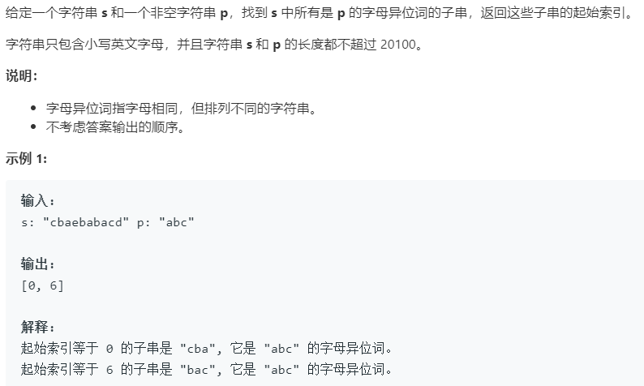

### 题目要求



### 解题思路

解题思路是双指针。具体套路参考[76 最小覆盖字串](76.md) 。主要是判断条件的更改。

### 本题代码

```c++
class Solution {
public:
    vector<int> findAnagrams(string s, string p) {
        vector<int>res;
        unordered_map<char,int>mp;
        for(auto c : p)
            mp[c]++;
        unordered_map<char,int>win;
        int left = 0;int right = 0;
        int match = 0;
        while(right < s.size()){
            char c1 = s[right];
            if(mp.count(c1) != 0){
                win[c1]++;
                if(win[c1] == mp[c1])
                    match++;
            }
            right++;
            while(match == mp.size()){
                if(right - left == p.size())
                    res.push_back(left);
                char c2 = s[left];
                if(mp.count(c2) != 0){
                    win[c2]--;
                    if(win[c2] < mp[c2])
                        match--;
                }
                left++;
            }
        }
        return res;
    }
};
```

### [手撸测试](<https://leetcode-cn.com/problems/find-all-anagrams-in-a-string/>) 

