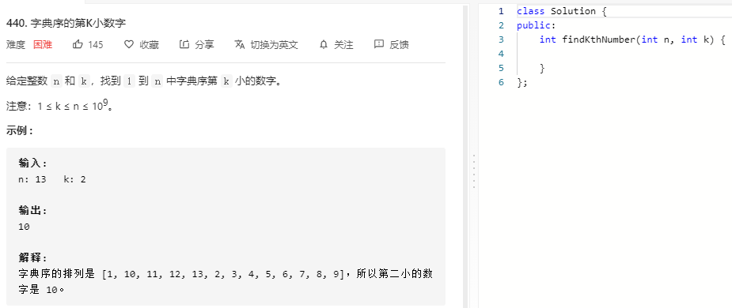

### 题目要求



### 解题思路

模仿十叉树的方法。套路是判断以i开头的到i+1开头数的个数跟k的关系，如果大于说明在该层i应该*10细致遍历，cnt++(因为字典序导致i\*10 < i+1)；如果该数段的个数小于等于k说明需要从下一层遍历i+1,cnt+count.最终返回i。

### 本题代码

```c++
class Solution {
public:
    int findKthNumber(int n, int k) {
        long long cnt = 1;
        long long pre = 1;
        while(cnt < k){
            long long count = get_count(n, pre);
            if(count + cnt > k){
                pre *= 10; //说明第k个数在pre开头的范围
                cnt++;
            }
            else{
                cnt += count;  // 说明第k个数不在pre开头的范围
                pre++;
            }
        }
        return pre;
    }
    long long get_count(long long n, long long pre){
        long long cur = pre;
        long long next = cur + 1;
        long long count = 0;
        while(cur <= n){
            count += min(n+1, next) - cur;
            cur *= 10;
            next *= 10;
        }
        return count;
    }
};
```

### [手撸测试](https://leetcode-cn.com/problems/k-th-smallest-in-lexicographical-order/)  

