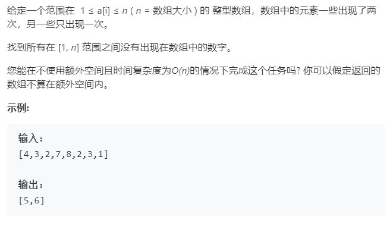

### 题目要求



### 解题思路

桶排序的思路，也就是抽屉原理。关键是`nums[i] = i + 1`，也就是将`nums[i]`放置到`nums[nums[i] - 1]`处。如果相等的话就不用互换。

### 本题代码

```c++
class Solution {
public:
    vector<int> findDisappearedNumbers(vector<int>& nums) {
        if(nums.size() == 0)
            return nums;
        for(int i = 0;i < nums.size();i++){
            while(nums[i] != i + 1){
                if(nums[i] == nums[nums[i] - 1])
                    break;
                int index = nums[nums[i] - 1];
                nums[nums[i] - 1] = nums[i];
                nums[i] = index;
            }
        }
        vector<int>res;
        for(int i = 0;i < nums.size();i++){
            if(nums[i] != i + 1)
                res.push_back(i + 1);
        }
        return res;
    }
};
```

### [手撸测试](<https://leetcode-cn.com/problems/find-all-numbers-disappeared-in-an-array/>) 

