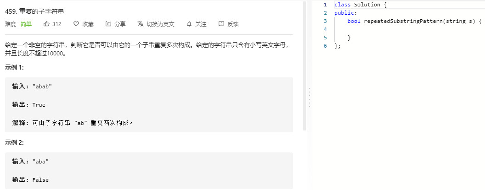

### 题目要求



### 解题思路

简单题然而并不能做出来......  难受

如果s能用其自身的前缀构成，那么s+s祛除第一个和最后一个字符的字串一定包含s.

### 本题代码

```c++
class Solution {
public:
    bool repeatedSubstringPattern(string s) {
        return (s+s).find(s, 1) != s.size();
    }
};
```

### [手撸测试](https://leetcode-cn.com/problems/repeated-substring-pattern/)  

