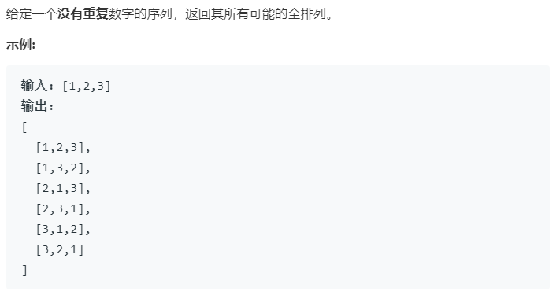

### 题目要求



### 解题思路

直接全排列就完事了。

### 本题代码

```c++
class Solution {
public:
    vector<vector<int>> permute(vector<int>& nums) {
        if(nums.size() == 0)
            return vector<vector<int>>();
        vector<vector<int>>res;
        perm(nums, res, 0);
        return res;
    }
    void perm(vector<int>& nums, vector<vector<int>>& res, int k){
        if(k >= nums.size())
            res.push_back(nums);
        else{
            for(int i = k;i < nums.size();i++){
                swap(nums, i, k);
                perm(nums, res, k + 1);//注意这里，从开始的下一个位置全排列
                swap(nums, i, k);
            }
        }
    }
    void swap(vector<int>& nums, int i, int j){
        int temp = nums[i];
        nums[i] = nums[j];
        nums[j] = temp;
    }
};
```

### [手撸测试](<https://leetcode-cn.com/problems/permutations/>) 

