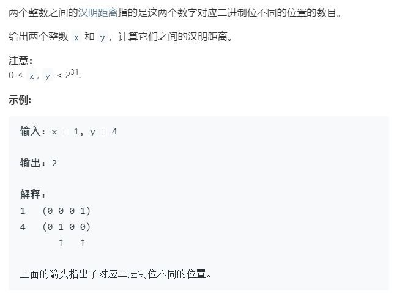

### 题目要求



### 解题思路

先异或，然后统计1的个数。核心在于如何统计1的个数，两种需要记住的方法：`n &= (n - 1)`以及`n -= (~n + 1)`。这两个代码的含义都是为了抹除最右边1的操作(需要牢记，位运算相关的都与此有些关系)。

### 本题代码

```c++
class Solution {
public:
    int hammingDistance(int x, int y) {
        x = x ^ y;
        int res = 0;
        while(x != 0){
            res += 1;
            x -= x & (~x + 1);
        }
        return res;
    }
};
```

### [手撸测试](<https://leetcode-cn.com/problems/hamming-distance/>) 

