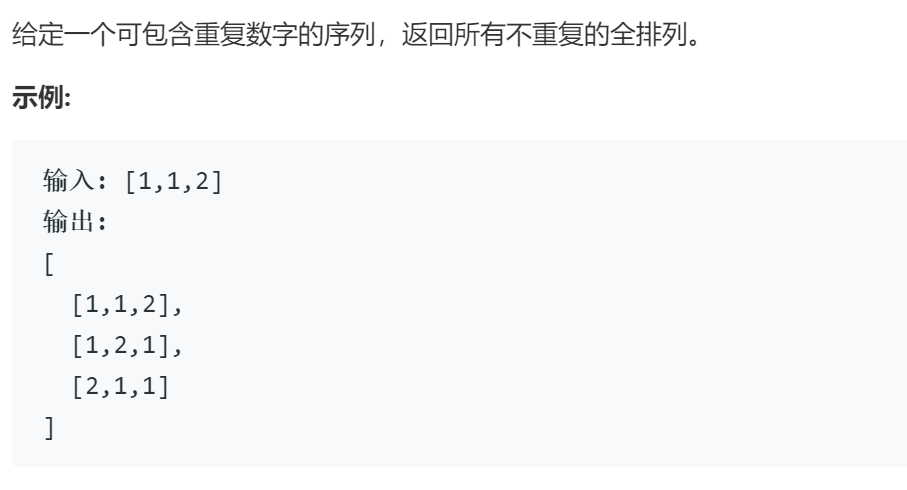

### 题目要求



### 解题思路

全排列中有重复的需要在排序中判断`begin`到待选项`i`之间重复项。

### 本题代码

```c++
class Solution {
public:
    vector<vector<int>> permuteUnique(vector<int>& nums) {
        if(nums.size() == 0)
            return vector<vector<int>>();
        vector<vector<int>>res;
        help(nums, res, 0);
        return res;
    }
    void help(vector<int>& nums, vector<vector<int>>& res, int begin){
        if(begin >= nums.size()){
            res.push_back(nums);
        }
        else{
            for(int i = begin;i < nums.size();i++){
                if(is_ok(nums, begin, i)){
                    swap(nums, begin, i);
                    help(nums, res, begin+1);
                    swap(nums, begin, i);
                }
            }
        }
    }
    bool is_ok(vector<int>& nums, int begin, int i){
        if(begin < i){
            for(int j = begin;j < i;j++){
                if(nums[j] == nums[i])
                    return false;
            }
        }
        return true;
    }
    void swap(vector<int>& nums, int i, int j){
        int temp = nums[i];
        nums[i] = nums[j];
        nums[j] = temp;
    }
};
```

### [手撸测试](https://leetcode-cn.com/problems/permutations-ii/)  

