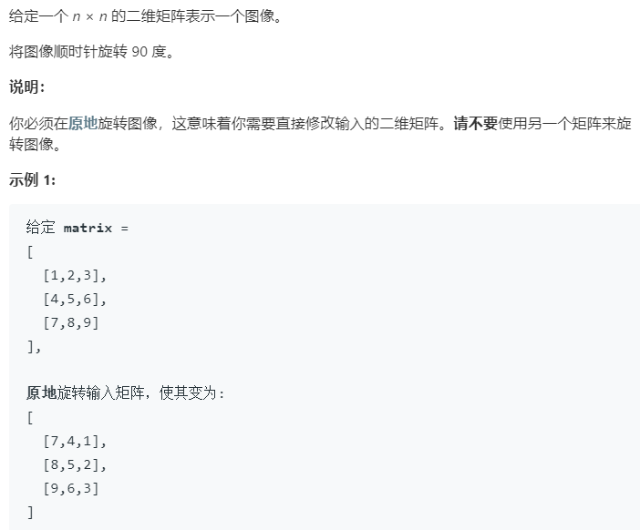

### 题目要求



### 解题思路

遇到矩阵旋转打印以及矩阵旋转等问题，常见的一个思路是确定矩阵的遍历方式--固定左上和右下就可以确定一个矩阵。本题也一样，但是要考虑交换的圈数`time`以及交换值的顺序。

### 本题代码

```c++
class Solution {
public:
    void rotate(vector<vector<int>>& matrix) {
        if(matrix.size() == 0)
            return;
        int tr = 0;int tc = 0;
        int dr = matrix.size() - 1;
        int dc = matrix[0].size() - 1;
        while(tr < dr){
            int times = dr - tr;
            for(int i = 0;i < times;i++){
                int temp = matrix[tr][tc + i];
                matrix[tr][tc + i] = matrix[dr - i][tc];
                matrix[dr - i][tc] = matrix[dr][dc - i];
                matrix[dr][dc - i] = matrix[tr + i][dc];
                matrix[tr + i][dc] = temp;
            }
            tr++;
            tc++;
            dc--;
            dr--;
        }
    }
};
```

### [手撸测试](<https://leetcode-cn.com/problems/rotate-image/>) 

