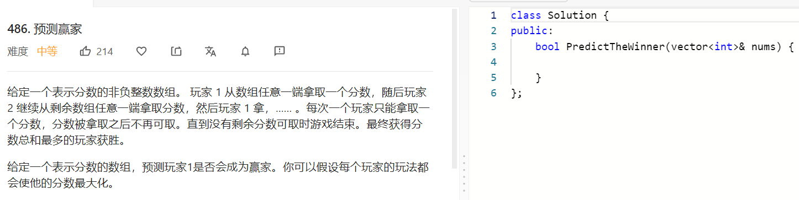

### 题目要求



### 解题思路

动态规划。设置状态$$dp[i][j]$$表示的是在[i,j]范围内，当前玩家与另一个玩家的差值最大值，即score(当前玩家)-score(另一玩家)。因此先手玩家选择nums[i]，那么$$dp[i+1][j]$$就是后手玩家比先手玩家的最大差值，那么想保持先手玩家与后手玩家的差值需要$$nums[i] - dp[i+1][j]$$，如果先手玩家选择的是nums[j]则同理。

### 本题代码

```c++
class Solution {
public:
    bool PredictTheWinner(vector<int>& nums) {
        int len = nums.size();
        vector<vector<int>>dp(len, vector<int>(len, 0));
        for(int i = 0;i < len;i++){
            dp[i][i] = nums[i];
        }
        for(int i = len - 2;i >= 0;i--){
            for(int j = i+1;j < len;j++){
                dp[i][j] = max(nums[i] - dp[i+1][j], nums[j] - dp[i][j-1]);
            }
        }
        return dp[0][len-1] >= 0;
    }
};
```

### [手撸测试](https://leetcode-cn.com/problems/predict-the-winner/)  

