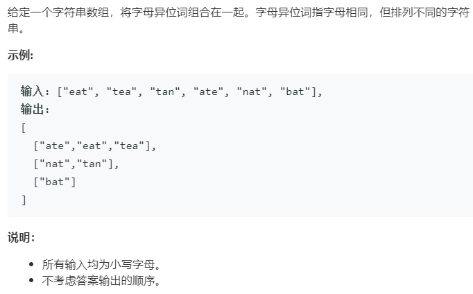

### 题目要求



### 解题思路

建一个`hash`表，遍历输入`strs`中的字符串--先排序得到`hash`的键，最后`push`到对应的值里。最后遍历一遍`hash`表的值加入`res`中。

### 本题代码

```c++
class Solution {
public:
    vector<vector<string>> groupAnagrams(vector<string>& strs) {
        if(strs.size() == 0)
            return vector<vector<string>>();
        vector<vector<string>>res;
        unordered_map<string, vector<string>>m;
        for(int i = 0;i < strs.size();i++){
            string s = strs[i];
            sort(s.begin(), s.end());
            m[s].push_back(strs[i]);
        }
        for(auto s : m){
            res.push_back(s.second);
        }
        return res;
    }
};
```

### [手撸测试](<https://leetcode-cn.com/problems/group-anagrams/>) 

