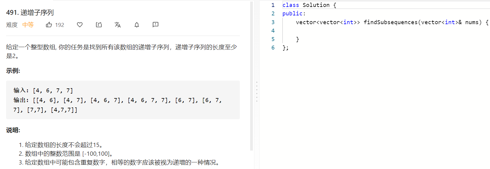

### 题目要求



### 解题思路

回溯+剪枝的方法可以解决。

### 本题代码

```c++
class Solution {
public:
    vector<int>temp;
    vector<vector<int>>res;
    vector<vector<int>> findSubsequences(vector<int>& nums) {
        if(nums.size() <= 1)
            return res;
        dfs(0, INT_MIN, nums);
        return res;
    }
    void dfs(int cur, int last, vector<int> nums){
        if(cur == nums.size()){
            if(temp.size() >= 2)
                res.push_back(temp);
            return;
        }
        if(nums[cur] >= last){
            temp.push_back(nums[cur]);
            dfs(cur + 1, nums[cur], nums);
            temp.pop_back();
        }
        if(nums[cur] != last){
            dfs(cur+1, last, nums);
        }
    }
};
```

### [手撸测试](https://leetcode-cn.com/problems/increasing-subsequences/)   

