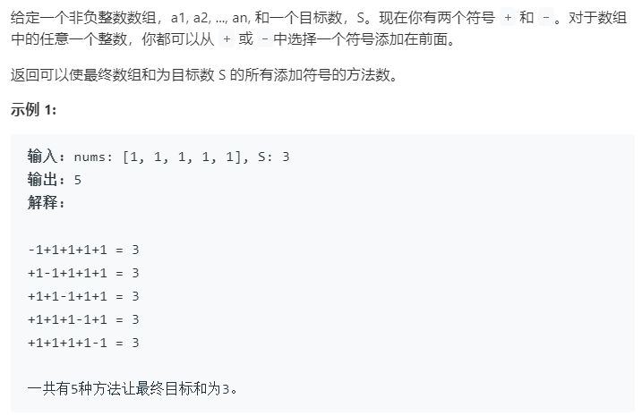

### 题目要求



### 解题思路

#### 解法1 DFS

算法复杂度是$$O(2^N)$$, 每次可以选择加或者减。

#### 解法2 转换为背包问题

核心推导：$$Sum(P) - Sum(N) = S$$,其中$$Sum(P) $$表示的是所有的正数和，$$- Sum(N)$$表示的是所有的负数和。那么$$Sum(P) - Sum(N) + Sum(P) + Sum(N) = S + Sum(P) + Sum(N)$$,又可知$$Sum(N) + Sum(P) = Sum(nums)$$其中`nums`是整个数组。进而化简可得$$2 * Sum(P) = S + Sum(nums)$$，最后可以转换为背包问题：即求解nums中有多少子集满足子集和为$$S+Sum(nums)/2$$。

### 本题代码

#### 解法1 DFS

```c++
class Solution {
public:
    int findTargetSumWays(vector<int>& nums, int S) {
        int res = 0;
        dfs(nums, S, 0, res);
        return res;
    }
    void dfs(vector<int>& nums, long int S, int i, int& res){
        if(i >= nums.size()){
            if(S == 0)
                res++;
            return;
        }
        dfs(nums, S + nums[i], i + 1, res);
        dfs(nums, S - nums[i], i + 1, res);
    }
};
```

#### 解法2 0-1背包【动态矩阵优化的算法】

```c++
class Solution {
public:
    int findTargetSumWays(vector<int>& nums, int S) {
        if(nums.size() == 0)
            return 0;
        int sum = 0;
        for(int num : nums)
            sum += num;
        if(sum < S) // 得首先判断这个条件 不然会导致溢出
            return 0;
        long int target = sum + S;
        if(target & 1 == 1)
            return 0;
        target /= 2;
        vector<int>dp(target + 1, 0);
        dp[0] = 1;
        for(int num : nums){
            int i = target;
            while(i >= num){ //倒着遍历
                dp[i] += dp[i - num];
                i--;
            }
        }
        return dp[target];
    }
};
```

解法2 模板子集和背包问题, 来源[labuladong](https://leetcode-cn.com/u/labuladong/) 

### [手撸测试](<https://leetcode-cn.com/problems/target-sum/>) 

