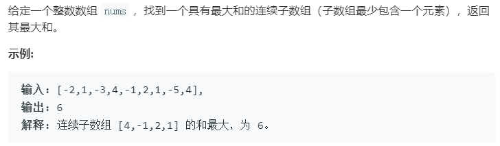

### 题目要求



### 解题思路

用两个变量--`cur`和`res`实现动态规划。`cur`表示的是当前累加的大小，如果它小于零就重置为`nums[i]`，然后每一次遍历判断保存最大结果值。

### 本题代码

```c++
class Solution {
public:
    int maxSubArray(vector<int>& nums) {
        if(nums.size() == 0)
            return 0;
        int res = nums[0];
        int cur = nums[0];
        for(int i = 1;i < nums.size();i++){
            if(cur < 0)
                cur = nums[i];
            else
                cur += nums[i];
            res = max(res, cur);
        }
        return res;
    }
};
```

### [手撸测试](<https://leetcode-cn.com/problems/maximum-subarray/>) 
