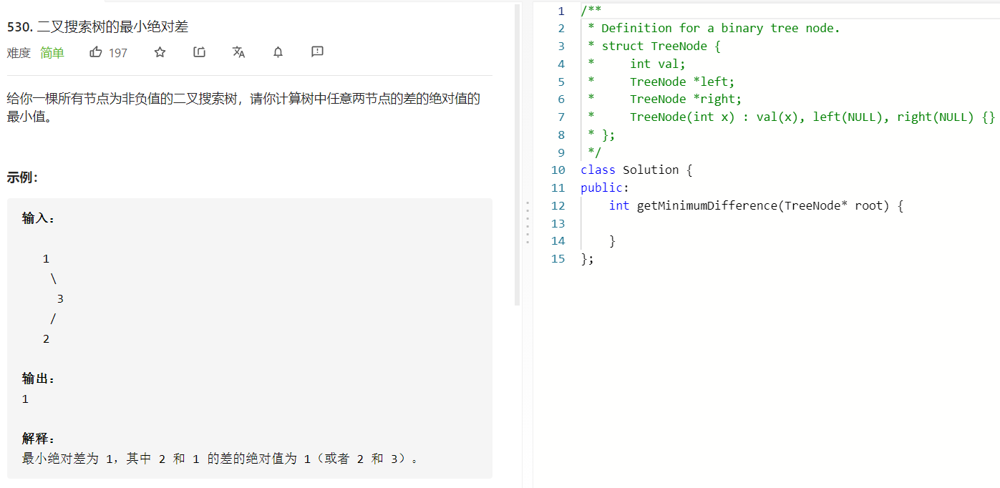

### 题目要求



### 解题思路

中序遍历。因为是二叉搜索树，因此可以直接紧邻的两两比较就可以。只不过需要记录上一次便利的结果。

### 本题代码

```c++
class Solution {
public:
    int getMinimumDifference(TreeNode* root) {
        if(root == NULL)
            return 0;
        int res = INT_MAX;
        int pre = -1;
        dfs(root, res, pre);
        return res;
    }
    void dfs(TreeNode* root, int & res, int& pre){
        if(root == NULL)
            return;
        dfs(root->left, res, pre);
        if(pre == -1){
            pre = root->val;
        }
        else{
            res = min(res, abs(root->val - pre));
            pre = root->val;
        }
        dfs(root->right, res, pre);
        
    }
};
```

### [手撸测试](https://leetcode-cn.com/problems/minimum-absolute-difference-in-bst/) 

