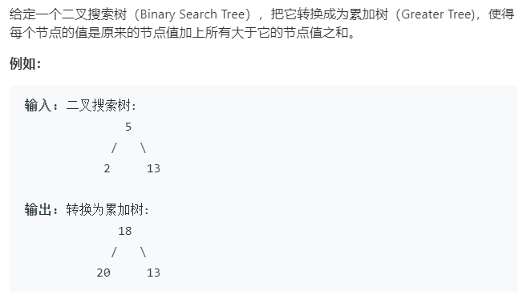

### 题目要求



### 解题思路

二叉搜索树的中序遍历就是一个递增序列。这道题也没啥思想含量递归就完事了。但是注意一点每次右节点加完后才能进行根节点然后才能左节点，也就是说所有左节点都是在根节点的基础上的。

### 本题代码

```c++
class Solution {
public:
    int val = 0; // 必须要有的
    TreeNode* convertBST(TreeNode* root) {
        if(root == NULL)
            return root;
        convertBST(root->right);
        root->val += val;
        val = root->val;
        convertBST(root->left);
        return root;
    }
};
```

### [手撸测试](<https://leetcode-cn.com/problems/convert-bst-to-greater-tree/>) 

