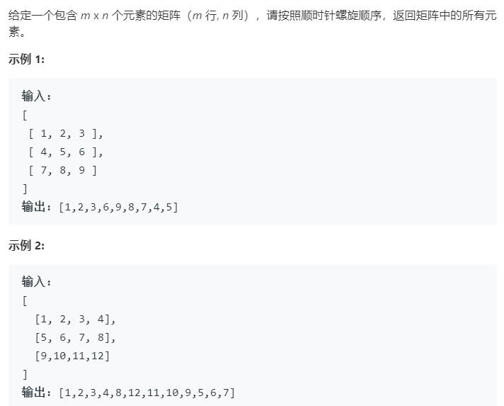

### 题目要求



### 解题思路

矩阵转圈打印的精髓在于确定左上角以及右下角，然后判断打印即可。

### 本题代码

```c++
class Solution {
public:
    vector<int> spiralOrder(vector<vector<int>>& matrix) {
        if(matrix.size() == 0)
            return vector<int>();
        int tr = 0;
        int tc = 0;
        int dr = matrix.size() - 1;
        int dc = matrix[0].size() - 1;
        vector<int>res;
        while(tr <= dr && tc <= dc){
            if(tr == dr){
                for(int i = tc;i <= dc;i++){
                    res.push_back(matrix[tr][i]);
                }
            }
            else if(tc == dc){
                for(int i = tr;i <= dr;i++){
                    res.push_back(matrix[i][tc]);
                }
            }
            else{
                int curr = tr;
                int curc = tc;
                while(curc < dc){
                    res.push_back(matrix[tr][curc]);
                    curc++;
                }
                while(curr < dr){
                    res.push_back(matrix[curr][dc]);
                    curr++;
                }
                while(curc > tc){
                    res.push_back(matrix[dr][curc]);
                    curc--;
                }
                while(curr > tr){
                    res.push_back(matrix[curr][tc]);
                    curr--;
                }
            }
            tr++;
            tc++;
            dc--;
            dr--;
        }
        return res;
    }
};
```

### [手撸测试](<https://leetcode-cn.com/problems/spiral-matrix/>) 

