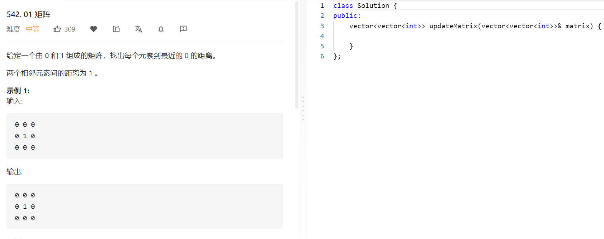

### 题目要求



### 解题思路

BFS，将0压入queue中，然后上下左右遍历，如果小于基准值那么就更新+1；

### 本题代码

```c++
class Solution {
public:
    vector<vector<int>> updateMatrix(vector<vector<int>>& matrix) {
        queue<pair<int, int>>q;
        for(int i = 0;i < matrix.size();i++){
            for(int j = 0;j < matrix[0].size();j++){
                if(matrix[i][j] == 0)
                    q.push(make_pair(i, j));
                else
                    matrix[i][j] = 10001;
            }
        }
        vector<pair<int, int>>around = {{0, 1}, {0, -1}, {1, 0}, {-1, 0}};
        while(!q.empty()){
            pair<int, int>temp = q.front();
            q.pop();
            for(int i = 0;i < 4;i++){
                int x = temp.second + around[i].second;
                int y = temp.first + around[i].first;
                if(x >= 0 && x < matrix[0].size() && y >= 0 && y < matrix.size() && matrix[temp.first][temp.second] < matrix[y][x]){
                    matrix[y][x] = matrix[temp.first][temp.second] + 1;
                    q.push({y, x});
                }
            }
        }
        return matrix;
    }
};
```

### [手撸测试](https://leetcode-cn.com/problems/01-matrix/)  

