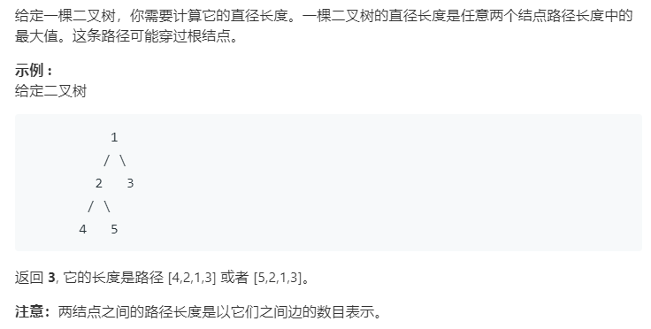

### 题目要求



### 解题思路

直接`DFS`求解。题意就是最大左树和右树高度值和。

### 本题代码

```c++
class Solution {
public:
    int diameterOfBinaryTree(TreeNode* root) {
        int res = 0;
        dfs(root, res);
        return res;
    }
    int dfs(TreeNode* root, int& res){
        if(root == NULL)
            return 0;
        int left = dfs(root->left, res);
        int right = dfs(root->right, res);
        res = max(left + right, res);
        return max(left, right) + 1;
    }
};
```

### [手撸测试](<https://leetcode-cn.com/problems/diameter-of-binary-tree/>) 

