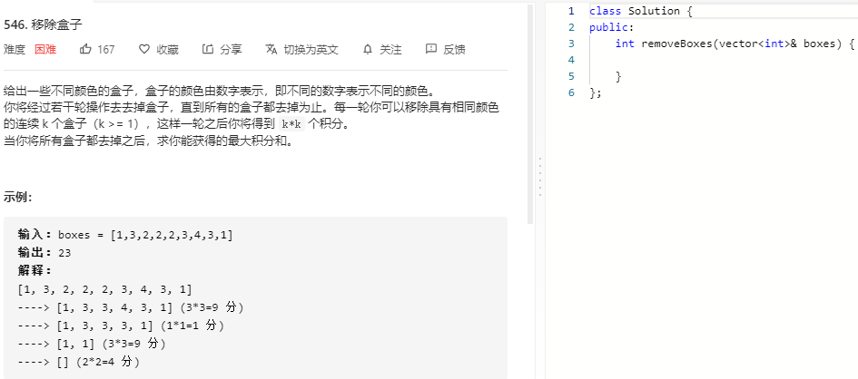
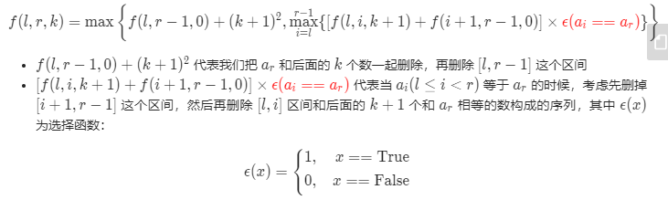

### 题目要求



### 解题思路

动态规划。使用dp\[i]\[j]\[k]来表示[i,j]区间在j之后有k和boxes[j]颜色相同的盒子。那么：



### 本题代码

```c++
class Solution {
public:
    int dp[100][100][100];
    int removeBoxes(vector<int>& boxes) {
        memset(dp, 0, sizeof(dp));
        return helper(boxes, 0, boxes.size()-1, 0);
    }
    int helper(vector<int>& boxes, int l, int r, int k){
        if(l > r)
            return 0;
        if(dp[l][r][k] != 0)
            return dp[l][r][k];
        while(r > l && boxes[r] == boxes[r-1]){
            r--;
            k++;
        }
        dp[l][r][k] = helper(boxes, l, r-1, 0) + (k+1) * (k+1);
        for(int i = l;i < r;i++){
            if(boxes[i] == boxes[r]){
                dp[l][r][k] = max(dp[l][r][k], helper(boxes, l, i, k+1) + helper(boxes, i+1, r-1, 0));
            }
        }
        return dp[l][r][k];
    }
};
```

### [手撸测试](https://leetcode-cn.com/problems/remove-boxes/)   

